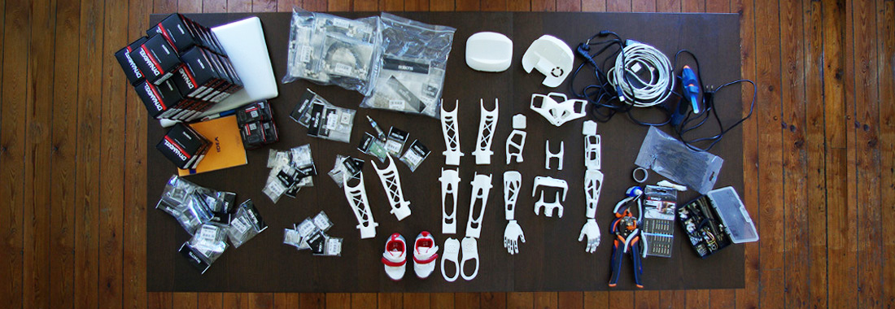

# Welcome on the _Poppy Wiki_
Here we will build all documentation and support needed to make Poppy a really <b>easy to use robot.</b> 

As we want to release Poppy 1.0 for the incoming summer, we are intensifying our efforts on the last critical development features and on <b>building a better website</b> for managing the community. Yet we <b>need external feedback</b> and this is why we need beta testers.

There is so many way you can help us:

- Building a Poppy and report bugs or potential improvements
- Experiment with the platform other applications
- Create new behaviors
- Develop missing features (software and hardware)
- Writing documentation
- Provide us help to enhance the website
- Discuss about your experience on how to manage open source projects
- Share your communication skills
- and much more !

We encourage you to use:

- This wiki to collaborate on the documentation and tutorials
- The <a href="https://forum.poppy-project.org/" target="_blank">forum</a href> ("stack-exchange" functionalities) to ask and answer questions
- The hardware & software <a href="https://github.com/poppy-project/" target="_blank">code repository</a href>
- The <a href="http://poppy-project.org" target="_blank">showcase portal</a href>

**Note:** You can use the <a href="https://drive.google.com/folderview?id=0B_q9MlqcWxlNeHlHcjdXdmhIRXc&usp=sharing" target="_blank">Poppy Google Drive</a href> space to upload/share files with POPPY team and the rest of the community

All our work is open source and available on the [poppy-project github page](https://www.github.com/poppy-project/). Software are distributed under GPLV3 licences and hardware is distributed under a [Creative Commons Attribution-NonCommercial-ShareAlike 3.0 licence](http://creativecommons.org/licenses/by-nc-sa/3.0/). 

Thanks for your support!

  

    
<a href="https://poppy-project-forum.bordeaux.inria.fr/" class="btn btn-primary btn-lg btn-block" role="button" target="_blank"><i class="fa fa-github fa-fw"></i> GitHub &raquo;</a>

  

  

    
<a href="https://drive.google.com/folderview?id=0B_q9MlqcWxlNeHlHcjdXdmhIRXc&usp=sharing" class="btn btn-lg btn-block" role="button" target="_blank"> <i class="fa fa-folder-open fa-fw"></i>Shared Folder &raquo;</a>

  

  

    
<a href="https://poppy-project-forum.bordeaux.inria.fr/" class="btn btn-danger btn-lg btn-block" role="button" target="_blank"><i class="fa fa-users fa-fw"></i> Forum &raquo;</a>

  

  

    
<a href="https://github.com/poppy-project/poppy-hardware-beta" class="btn btn-primary btn-lg btn-block" role="button" target="_blank"><i class="fa fa-github fa-fw"></i> Hardware design &raquo;</a>

  

  

    
<a href="https://grabcad.com/library/poppy-beta-2" class="btn btn-lg btn-block" role="button" target="_blank"> <i class="fa fa-folder-open fa-fw"></i>STL archived files &raquo;</a>

  

  

    
<a href="http://poppy-project.org" class="btn btn-danger btn-lg btn-block" role="button" target="_blank"><i class="fa fa-users fa-fw"></i> Showcase &raquo;</a>

  


  

    

      <h1> <em> {{ cat[0]}} </em> </h1>
      
        <a href="{{site.baseurl}}{{post.url}}"> <strong> {{post.title}} </strong> </a>
         
      
    

  



